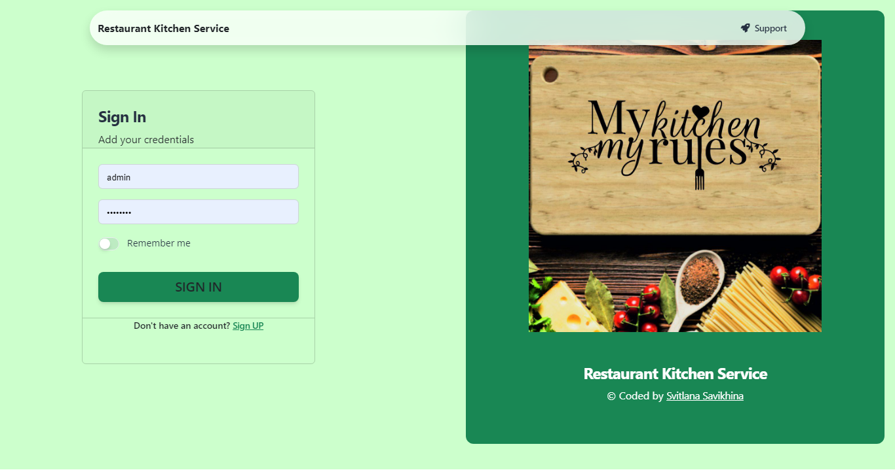
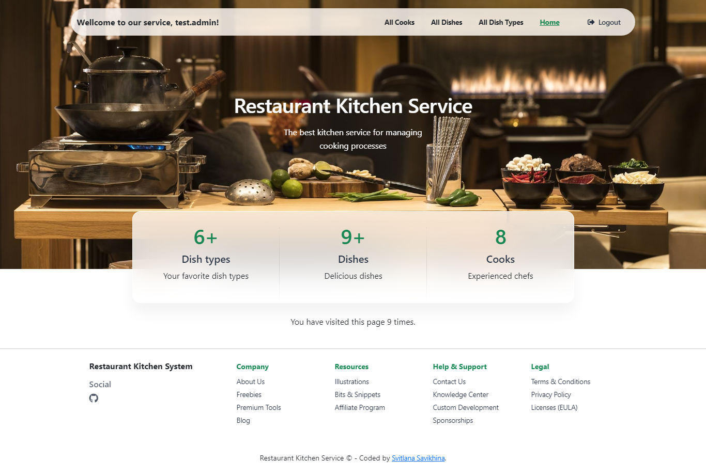
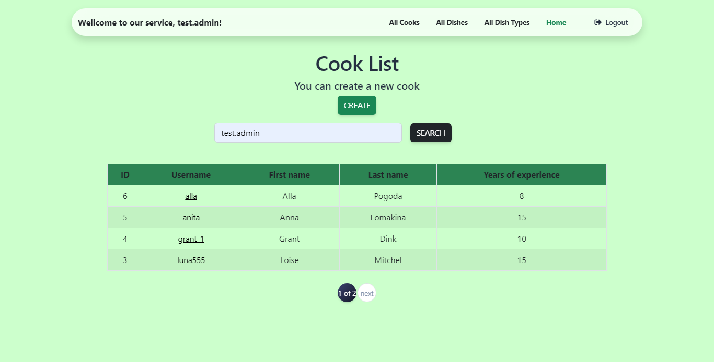
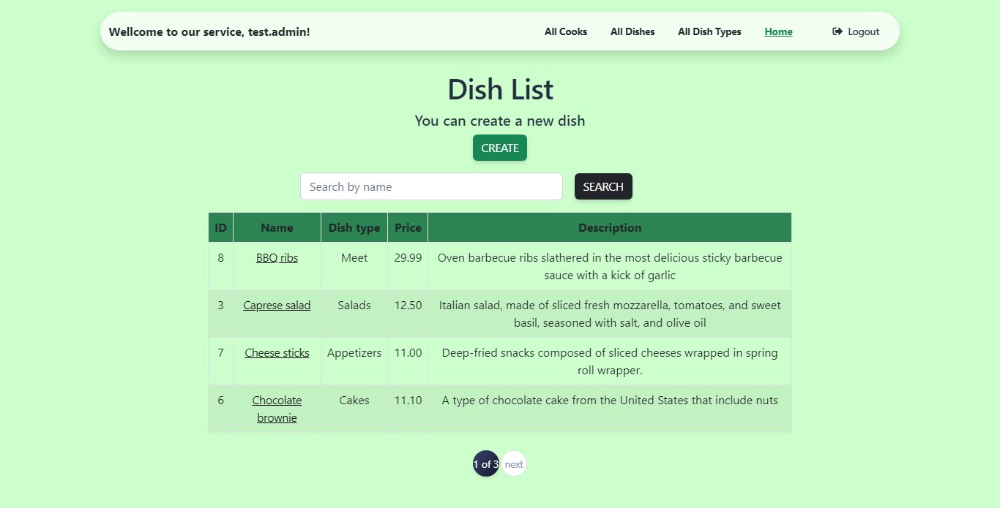
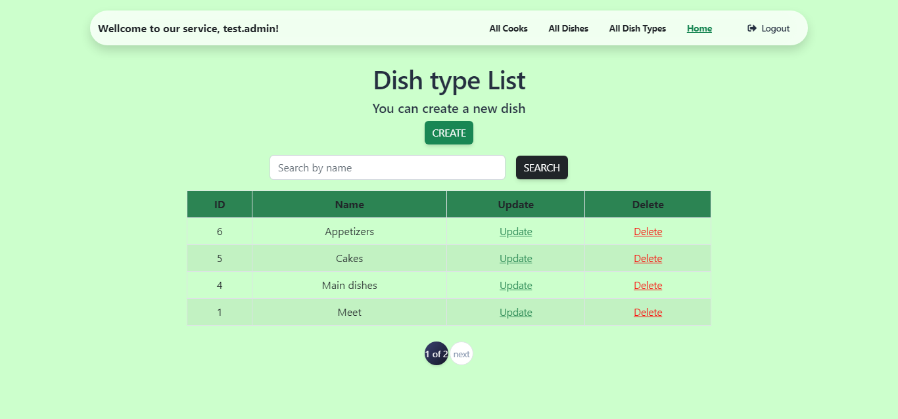

# Restaurant Kitchen Service
Django project for kitchen management in a restaurant. 
Using this project you can create, update and delete cooks, dishes and types of dishes

## Check it out!
[Restaurant Kitchen Service project deployed to Render](link)

* login: test.admin
* password: FGh12j33

## Installation
Python3 must be already installed

```shell
git clone https://github.com/svitlana-savikhina/restaurant-kitchen-service.git
cd restaurant-kitchen-service
python3 -m venv venv
source venv/bin/activate
pip install -r requirements.txt
python manage.py migrate
python manage.py runserver #starts Django Server
```
Also, you should create .env file in root directory.
Write a SECRET_KEY inside .env file (example you can find in .env_sample )
## Features
* Authentication functionality for Cook/User
* Managing cook, dishes and types of dishes directly from website interface 
* Strong Django admin panel 

## Demo




